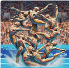
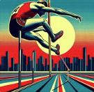

# Jogo de Memória Olímpico

Bem-vindo ao Jogo de Memória Olímpico! Este é um jogo de memória simples onde você precisa encontrar pares de cartas com imagens baseadas em diferentes estilos de artistas famosos (consegue descobri qual é). O tema do jogo é inspirado nos Jogos Olímpicos, trazendo uma combinação única de arte e esporte.

## Conteúdo

- [Visão Geral](#visão-geral)
- [Como Jogar](#como-jogar)
- [Estrutura do Projeto](#estrutura-do-projeto)
- [Tecnologias Utilizadas](#tecnologias-utilizadas)
- [Rascunhos](#rascunhos)
- [Contribuição](#contribuição)
- [Licença](#licença)

## Visão Geral

Este projeto é um jogo de memória onde o jogador precisa encontrar pares de cartas com imagens. Cada imagem foi criada baseada no estilo de um artista famoso, trazendo uma experiência visual única. O tema dos Jogos Olímpicos adiciona um toque especial ao jogo.

## Como Jogar

1. **Embaralhar**: Clique no botão "Embaralhar Novamente" para embaralhar as cartas.
2. **Virar Cartas**: Clique nas cartas para virá-las e encontrar pares.
3. **Revelar Todas**: Clique no botão "Revelar Todas as Cartas" para ver todas as cartas viradas.

## Tecnologias Utilizadas

- **HTML**: Estrutura básica da página.
- **CSS**: Estilização do jogo.
- **JavaScript**: Lógica do jogo, incluindo embaralhar, virar cartas e verificar correspondências.

## Imagens Usadas

Aqui estão as imagens usadas no jogo:

<table>
  <tr>
    <td></td>
    <td></td>
    <td></td>
    <td></td>
    <td></td>
  </tr>
  <tr>
    <td></td>
    <td></td>
    <td></td>
    <td></td>
    <td></td>
  </tr>

</table>

## Contribuição

Contribuições são bem-vindas! Se você encontrar algum problema ou tiver sugestões de melhorias, sinta-se à vontade para abrir uma issue ou enviar um pull request.

